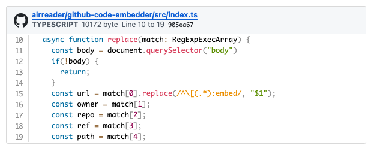

# GitHub Code Embedder
This is a script that expands a GitHub line permalink as an embed.

`[https://github.com/airreader/github-code-embedder/blob/905ea67c361e81825cb89725dd664212bc7afba2/src/index.ts#L10-L19:embed:lang=typescript]`

# Usage
1. Insert script tag.
    - ``
2. Copy permalink.
    - [Creating a permanent link to a code snippet - GitHub Docs](https://docs.github.com/get-started/writing-on-github/working-with-advanced-formatting/creating-a-permanent-link-to-a-code-snippet)
3. Processing permalinks into Embed notation
    - `[{permalink url}:embed:lang={lang}]`
        - optional: You can specify the height using the :h option.
        - `[{permalink url}:embed:lang={lang}:h400]`
> [!TIP]
> **In the case of Hatena Blog**
> 
> Hatena Blog automatically expands URLs into links, so you need to stop automatic linking by scissoring with [][] as follows
>
> `[][{permalink url}:embed:lang={lang}][]`
